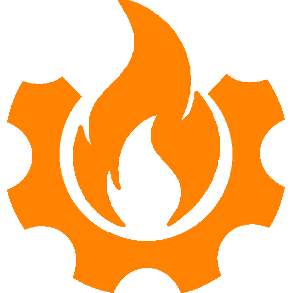

  
  <h1 align="center">Kontraption</h1>

A Space Engineers inspired addon for Mekanism utilizing Valkyrien Skies 2. Aims to add numerous new blocks to create and pilot airships but also new factories to produce high efficiency fuels.

## Features

> Ship Control Interface(WIP) - A interface through which the player can control the ship.

> Gyro(WIP) - Stabilizes the ship rotation and provides rotational controls.

> Ion Thruster - A simple weak thruster that uses energy.

> Liquid Fuel Thruster(WIP) - A 3x3x3 to 17x17x17 multiblock thruster.

> Gatling gun(NYI) - A static gun that uses various metals as ammunition.

> Mining Drill(NYI) - A mining drill, gives 1.5x more ores.

## Contributing
Pull requests are welcome (please help 🥺)
In a PR list all of the additions, changes and removals of stuff.
